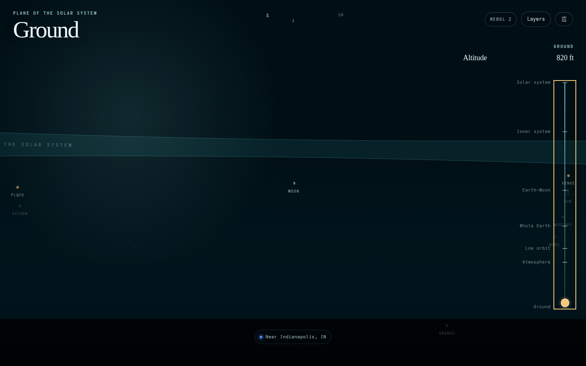
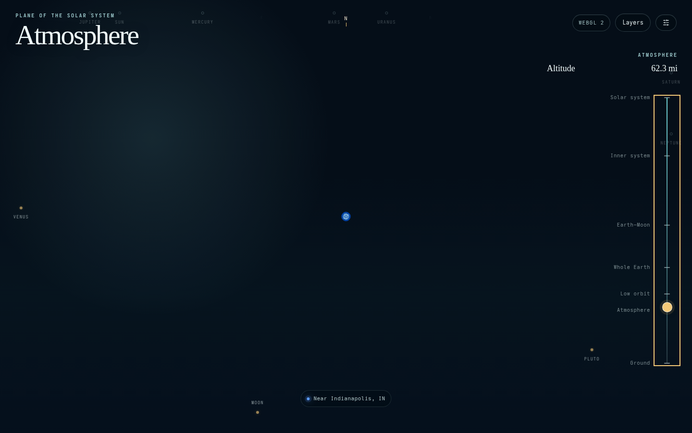
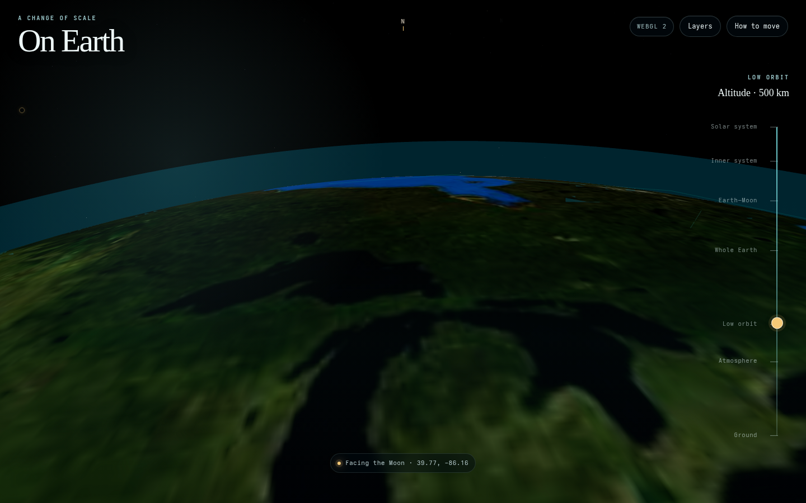
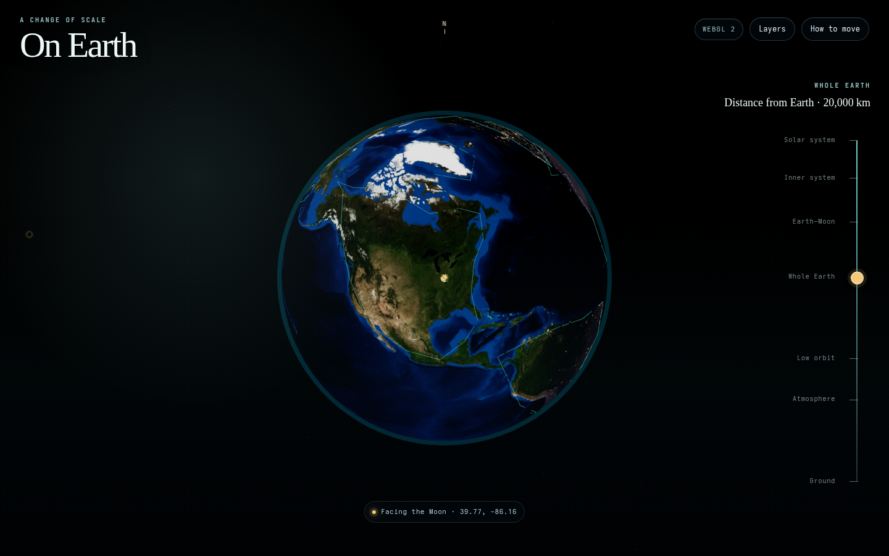
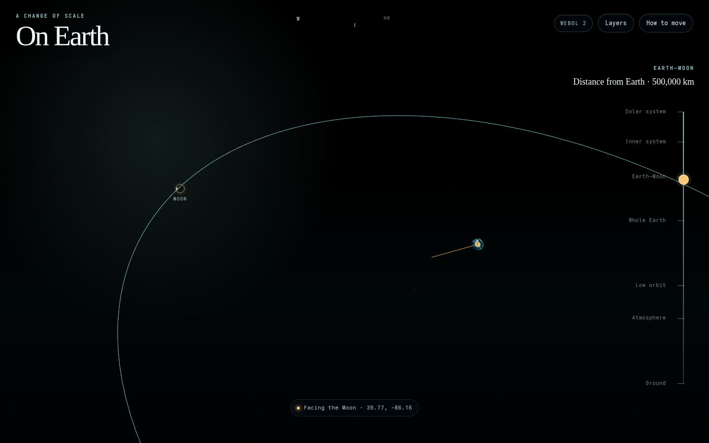

# Plane of the Solar System

An immersive experience that begins about two meters above Earth under the real current sky, and lets you pull continuously outward until the horizon becomes the limb of a whole planet.

**Live app:** [dbirks.github.io/plane-of-the-solar-system](https://dbirks.github.io/plane-of-the-solar-system/)

All six phases of `SPEC.md` (0–5) are implemented: the precision ground-to-whole-Earth journey, the real sky, the Earth–Moon system, the full solar system to Pluto, and the experience layer — all at true scale.

## What works

- **The real sky for your place and moment**: the Sun, Moon, bright planets, and 2,865 catalog stars occupy their true directions, computed by astronomy-engine and cross-validated against an independent Meeus reference
- The Moon shows its actual phase — the terminator is physical geometry lit by the true Sun direction, never a texture
- A deterministic opening view: the camera greets you facing the Moon, the setting Sun, a bright planet, or a bright star
- Screen-space markers with click-to-look for every bright body, ghosted below the horizon, edge-pinned when off-view
- A live sliding compass, day/twilight/night sky driven by true Sun altitude, and stars that emerge through dusk
- Keep pulling out to the **Earth–Moon landmark at 500,000 km**: the physical Moon at true, uncompressed distance, its real orbit traced around Earth, and a sunlight-direction guide — with a jump-free hand-off from the sky view
- Click the Moon for an inspection inset: phase disc, phase name, illuminated fraction, and distance, always matching the scene geometry
- Continue out to the **inner system (2.7 AU)** and the **full solar system (53 AU)**: every planet to Pluto at its true current position and radius, riding precomputed orbit lines, with faint ecliptic rings making the plane of the solar system visible
- On the way out, the view **rolls from your local "up" onto the plane of the solar system** — starting as the atmosphere gives way to space and complete by the Earth–Moon landmark, the ecliptic settles flat on screen while your ground tilts away, revealing that you were standing on the side of a planet
- Select any body's marker for distances and magnitude; nothing is ever enlarged — markers carry the discoverability
- **NASA Blue Marble** Earth with **Black Marble city lights** on the physically-lit night side (async-loaded, ~1.1 MB, attributed)
- A Layers panel for optional explanation geometry: orbits, ecliptic rings, Moon orbit, sunlight direction, Earth axis & equator, sky grid, labels — sparse by default
- Marker labels declutter automatically when bodies crowd; optional device-compass alignment; adaptive pixel-ratio under sustained slow frames
- Offline location chain (URL → saved → timezone guess → fallback) with a picker for manual coordinates and opt-in device location — never a permission prompt on opening
- Direct Three.js `WebGPURenderer` with automatic WebGL 2 fallback and forced-WebGL mode
- Camera-relative rendering with canonical double-precision meter values; smooth, damped piecewise-logarithmic travel through ground, atmosphere, low orbit, and whole Earth
- Fixed time/location/debug controls, live precision/performance telemetry, and reduced-motion support
- 75 unit tests, 44 Playwright scenarios (desktop + mobile), and GitHub Pages deployment

## Run locally

```bash
pnpm install
pnpm dev
```

Open `http://127.0.0.1:4173/`.

Useful reproducible parameters:

```text
?debug=1
?renderer=auto
?renderer=webgl
?depth=reversed
?depth=standard
?quality=low
?time=2026-07-11T22:00:00Z
?lat=39.7684&lon=-86.1581
```

## Verify

```bash
pnpm check
pnpm test:e2e
pnpm build:pages
```

Interactive acceptance uses the current Playwright agent CLI:

```bash
pnpx @playwright/cli@latest open http://127.0.0.1:4173/
pnpx @playwright/cli@latest snapshot
pnpx @playwright/cli@latest screenshot
```

## Screenshots

| Ground                                              | Atmosphere                                                  | Low orbit                                                 | Whole Earth                                                   | Earth–Moon                                                  |
| --------------------------------------------------- | ----------------------------------------------------------- | --------------------------------------------------------- | ------------------------------------------------------------- | ------------------------------------------------------------ |
|  |  |  |  |  |

Mobile captures and debug evidence are also available in [`artifacts/screenshots/`](artifacts/screenshots/).

See [`docs/PRECISION_REPORT.md`](docs/PRECISION_REPORT.md) for measured results and known limitations, and [`docs/ADR/`](docs/ADR/) for technical decisions.
