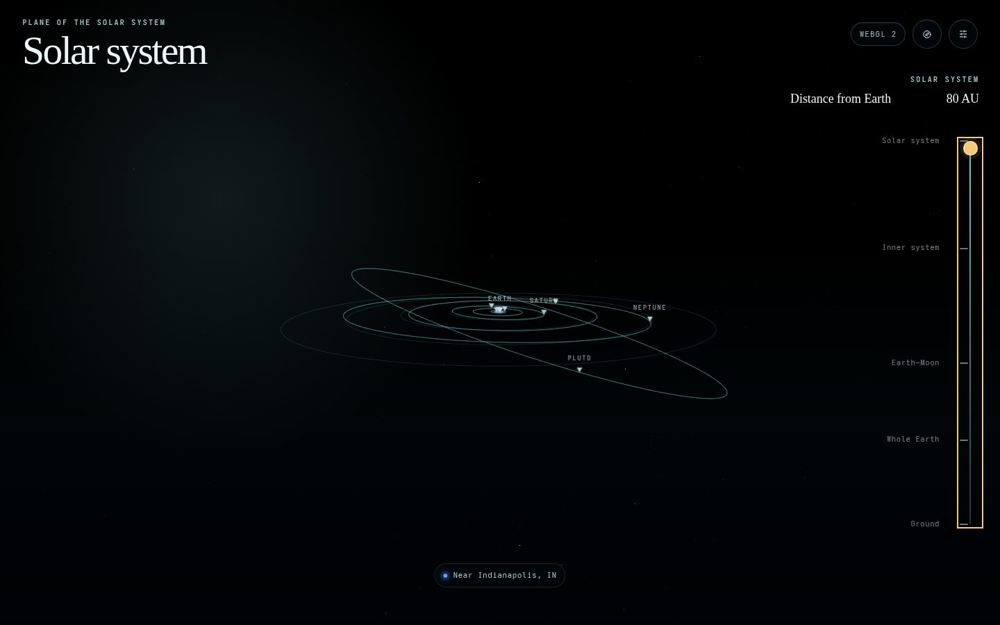

# Plane of the Solar System

An immersive experience that begins about two meters above Earth under the real current sky, and lets you pull continuously outward until the horizon becomes the limb of a whole planet.

**Live app:** [dbirks.github.io/plane-of-the-solar-system](https://dbirks.github.io/plane-of-the-solar-system/)

All six phases of `SPEC.md` (0–5) are implemented: the precision ground-to-whole-Earth journey, the real sky, the Earth–Moon system, the full solar system to Pluto, and the experience layer — all at true scale.

## What works

- **The real sky for your place and moment**: the Sun, Moon, bright planets, and 2,865 catalog stars occupy their true directions, computed by astronomy-engine and cross-validated against an independent Meeus reference
- The Moon shows its actual phase — the terminator is physical geometry lit by the true Sun direction, never a texture
- A deterministic opening view: the camera greets you facing the Moon, the setting Sun, a bright planet, or a bright star
- Screen-space markers tuned by regime: **soft muted circles** around on-screen bodies in the sky view, **label-over-arrow pointers** out in space (an arrow suggests no size), hollow circles when ghosted below the horizon, and edge-pinned arrows that rotate to point off-screen toward the body (hollow triangles when it's also below the horizon), named
- A live sliding compass (which bows out once cardinal directions stop meaning anything), day/twilight/night sky driven by true Sun altitude, stars that emerge through dusk, and **sunset/sunrise glows on the horizon** that appear only around their own events — the sunset glow from shortly before sunset to about an hour after, the sunrise glow mirrored
- A two-sentence **first-visit welcome**, and a single **Settings dialog** behind the header's sliders icon (title and close pinned while it scrolls): how to move, pointing with your phone, described switch toggles for the guide geometry, and per-source credit links; the header title tracks your landmark live, and altitude readouts include your real ground elevation
- The pull-out opens like a map: by ~60 m you're looking **straight down at real satellite imagery of where you stand** (Esri World Imagery, street-sharp, cached on your device), degrading gently through **seven nested detail levels** on the way out; **after dark the real city lights come up** (NASA VIIRS Black Marble, glowing amber over the night-dimmed streets from ~25 km). The zoom-out stays **dead-centered on your blue dot** to ~200 km, then the view banks once into Earth **centered and visibly tilted against the flat plane, your dot on its front face, axis stubs reading the tilt** — and from there to 100 AU it only zooms
- **Pinch to travel**: two fingers zoom the journey itself, at every scale — pinching in from the ball descends back into your neighborhood
- From whole Earth out, **dragging orbits you around the planet** (Earth stays centered, like turning a globe) instead of panning the view; an Earth marker with top label priority joins the system-scale sky
- Keep pulling out to the **Earth–Moon landmark at 500,000 km (310,686 mi)**: the physical Moon at true, uncompressed distance, its real orbit traced around Earth, and a sunlight-direction guide — with a jump-free hand-off from the sky view
- Click the Moon for an inspection inset: the **NASA LRO lunar nearside rendered as the phase disc** (crisp at your device's pixel ratio, dark side in faint earthshine), phase name, illuminated fraction, and distance, always matching the scene geometry
- Click any planet for the same treatment: **its real surface as a disc at its true current phase** (Venus shows a genuine crescent or gibbous; Jupiter is effectively always full), from bundled Solar System Scope maps (CC BY 4.0) — **Pluto shows its New Horizons heart** (NASA/JHUAPL/SwRI), and **Mars notes its current Martian season**
- Continue out to the **inner system (2.7 AU)** and the **full solar system (100 AU)**: every planet to Pluto at its true current position and radius — Pluto's whole orbit inside the final frame — riding precomputed orbit lines in the plane of the solar system
- Sky proxies track the camera's true position and hand off to the physical heliocentric bodies **exactly in place** (never a second sun mid-transition), and the far plane stretches at system scales so distant orbit lines arrive whole instead of drawing themselves in
- The **plane of the solar system is drawn at every scale**: a labeled ecliptic band across the real sky from the ground (the strip the Sun, Moon, and planets ride, captioned "Plane of the solar system"), a **dotted continuation below the horizon** so the band visibly loops the whole sky, and Earth's own orbit line around the Sun — its height over your head is pinned to astronomy-engine in tests (low on July evenings, high on January ones: that's the sky, not a bug). The band steps aside for the map/satellite leg and returns in space, labeled and passing cleanly **behind** the globe
- Select any body's marker for distances and magnitude; nothing is ever enlarged — markers carry the discoverability
- **NASA Blue Marble** Earth with **Black Marble city lights** on the physically-lit night side, and the **NASA LRO lunar surface** on the physically-lit Moon (async-loaded, attributed); up close the globe holds a clean stylized tone until the imagery is at native resolution
- A Guides section (in Settings) for optional explanation geometry: orbits, the ecliptic plane band, Moon orbit, sunlight direction, Earth axis & equator, sky grid, labels — sparse by default
- Marker labels declutter automatically when bodies crowd; adaptive pixel-ratio under sustained slow frames
- **Compass mode** (header toggle, offered on first visit with a plain explanation of the motion-permission prompt): device orientation drives the camera as a full attitude quaternion, with a deliberately paranoid magnetometer calibration — sampled only near level attitudes, slow, and rejecting the 180° branch-flips the platform compass reference throws when the phone tips past upright; the choice **persists across visits**, and off the ground the toggle shows dormant (tilt belongs to the ground); `?compassdebug=1` shows the live sensor numbers
- A **screen wake lock** keeps the display on while you watch the sky, where the browser supports it
- Distances read in **miles or kilometres by your device's region** (US/GB/LR/MM get miles; `?units=mi|km` overrides); astronomical distances stay in AU
- Offline location chain (URL → saved → timezone guess → fallback) with a picker, a header **locate button**, and opt-in coarse device location (never high-accuracy; coordinates rounded to ~1 km) — never a permission prompt on opening, though a permission you granted on an earlier visit is adopted silently. **Applying a location re-aims the live scene in place** (no reload) and is remembered for next time; the blue chip shows a coarse "Near <city>" anchor instead of raw coordinates, and your maps-blue dot retires by the Earth–Moon landmark. Your location stays in the browser except for one disclosed use: fetching the close-up imagery tiles for your area (Esri; NASA night lights)
- Direct Three.js `WebGPURenderer` with automatic WebGL 2 fallback and forced-WebGL mode
- Camera-relative rendering with canonical double-precision meter values; smooth, damped piecewise-logarithmic travel through ground, atmosphere, low orbit, and whole Earth
- Fixed time/location/debug controls, live precision/performance telemetry, and reduced-motion support
- 97 unit tests, 44 Playwright scenarios (desktop + mobile), and GitHub Pages deployment

## Run locally

```bash
pnpm install
pnpm dev
```

Open `http://127.0.0.1:4173/`.

Useful reproducible parameters:

```text
?debug=1
?renderer=auto
?renderer=webgl
?depth=reversed
?depth=standard
?quality=low
?time=2026-07-11T22:00:00Z
?lat=39.7684&lon=-86.1581
?units=mi (or km)
```

## Verify

```bash
pnpm check
pnpm test:e2e
pnpm build:pages
```

Interactive acceptance uses the current Playwright agent CLI:

```bash
pnpx @playwright/cli@latest open http://127.0.0.1:4173/
pnpx @playwright/cli@latest snapshot
pnpx @playwright/cli@latest screenshot
```

## Screenshots

| Ground                                              | Whole Earth                                                   | Earth–Moon                                                  | Solar system                                                   |
| --------------------------------------------------- | ------------------------------------------------------------- | ----------------------------------------------------------- | -------------------------------------------------------------- |
|  |  |  |  |

Mobile captures and debug evidence are also available in [`artifacts/screenshots/`](artifacts/screenshots/).

See [`docs/PRECISION_REPORT.md`](docs/PRECISION_REPORT.md) for measured results and known limitations, and [`docs/ADR/`](docs/ADR/) for technical decisions.
